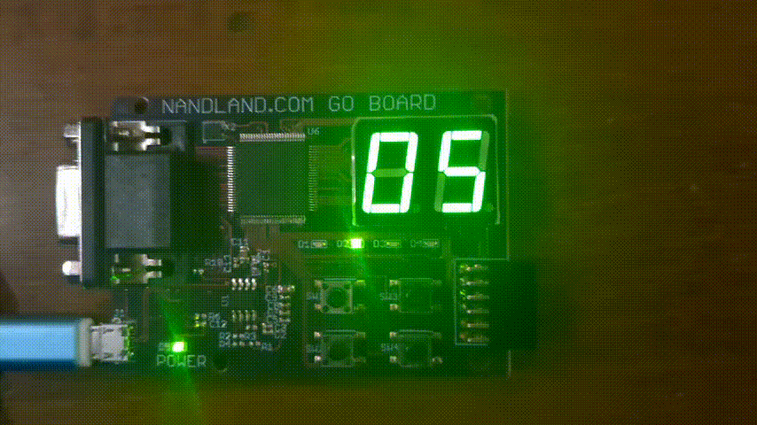

# Advent of Hardcaml

Hardcaml solutions for Advent of Code 2025, targeted for the iCE40 FPGA on the [nandland-go-board](https://nandland.com/the-go-board/).
Each solution receives the puzzle input text over UART and scrolls the answer across 2 seven-segment displays.



## Solution Progress:

| Day | Sim (Part 1) | FPGA (Part 1) | Sim (Part 2) | FPGA (Part 2) |
| --- | ------------ | ------------- | ------------ | ------------- |
| 01  | ✅          | ✅            | ✅          | ✅            |
| 02  | ✅          | ❌            | ✅          | ❌            |
| 03  | ✅          | ✅            | ✅          | ❌            |
| 04  | ✅          | ❌            | ✅          | ❌            |
| 05  | ✅          | ❌            | ✅          | ❌            |
| 06  | ✅          | ❌            | ✅          | ❌            |
| 07  | ✅          | ❌            | ✅          | ❌            |
| 08  | ❌          | ❌            | ❌          | ❌            |
| 09  | ✅          | ❌            | ✅          | ❌            |
| 10  | ✅          | ✅            | ❌          | ❌            |
| 11  | ✅          | ❌            | ✅          | ❌            |
| 12  | ✅          | ✅            | NA           | NA            |

All challenges completed except Day8 (both parts) and Day10 part 2.

Many days require more memory / registers / larger multipliers than are available on the ice40, and therefore could only run on the full AoC input in simulation. This could be mitigated in some cases by adjusting solutions to use the Hardcaml memory primitives.

Note: due to simulation performance limitations, Days 4 and 7 were only tested against a smaller grid.
All other days were tested against the full input, although only a subset/sample is included in this repository per AoC rules.

## Setup

Solutions were written in Hardcaml v0.17.1 on Linux (WSL).

```
opam switch 5.3.0
eval $(opam env)
opam install hardcaml.v0.17.1
opam install hardcaml_waveterm
opam install ppx_hardcaml
```

For development: 
```
opam install ocaml-lsp-server ocamlformat
```

## Simulation

Run `dune build` and `dune exec ./Days/Day01a/Day01a_tb.exe`, replacing the day number as needed. This will run the Cyclesim testbench. `01a` refers to Day1 part 1, use `01b` to refer to Day1 part 2. Day12 is simply 12 as there is only one part.

The testbench simulates the actual UART input character by character and checks the answer by reading the internal "answer" register. A sample input is provided and the answer is checked against the correct answer with an assert at the end of the testbench.

To simulate larger inputs quickly, increasing the serial "baud rate" is useful. Change 217 in [SerialTB.ml](common_modules/SerialTB.ml) and [UART_Decoder.ml](common_modules/UART_Decoder.ml) to 5. Sometimes, properties of the input (such as the expected number of characters in a line) are hardcoded into the design. This is noted in the design details below.

Note: inputs are typically required to use `\n` only as a line ending and to end with a `\n` at the end of the file.

Note: Day6 and Day11 require input preprocessing, which is achieved by running `dune exec ./Days/Day06a/Day06a_preprocess_input.exe` which converts the `Day06a_raw_input.txt` to the `Day06a_input.txt`. More details are included in the individual solution descriptions.

The testbenches also dump a waves.vcd file which can be inspected to debug the design.

Note: per AOC rules, complete puzzle inputs are not included in this repository. Instead, a subset of inputs or the sample input in the puzzle description is used instead.

## Flashing to FPGA

Setup a Python virtual environment and install apio with `pip install --force-reinstall -U git+https://github.com/fpgawars/apio.git@main`. apio provides the open source toolchain needed to build and flash the Verilog code.

Note: if using WSL, pass through the device using usbipd.

Run `dune build` and `dune exec ./Days/Day01a/Day01a_v.exe` replacing the day number as needed. This will generate the `solution.v` file inside the `verilog_build` folder.

Flashing:
```cmd
cd verilog_build
apio upload
```

### Sending input over UART:

The FPGA must be reset by pushing the SW1 button.
The input can then be sent over UART at 115200 baud using pyserial or similar.

```python
import serial

with open('tb_input.txt') as f:
    data = f.read()

com = serial.Serial('COM6', baudrate='115200')
com.write(data.encode('utf-8'))
com.close()
```

Note: inputs are typically required to use `\n` only as a line ending and to end with a `\n` at the end of the file.

The resulting answer will then be scrolled across the seven-segment displays.

Note: some inputs may require pausing after each line to allow the FPGA to process the input. This is noted in the solution details below.

## Solution Details

Each day folder contains the code for the corresponding day, with Day01a indicating Dec 1st, Part 1 and Day01b indicating Dec 1st, Part 2.

Inside the folder is the solution circuit ([Day01a.ml](Days/Day01a/Day01a.ml)), the Hardcaml testbench ([Day01a_tb.ml](Days/Day01a/Day01a_tb.ml)), and a Verilog generator file ([Day01a_v.ml](Days/Day01a/Day01a_v.ml)). A sample input for the testbench ([Day01a_input.txt](Days/Day01a/Day01a_input.txt)) is also included, along with the dune build system information.

### Days/Day01a

Uses an FSM to receive the L/R character and the digits. Digits are "shifted in" by multiplying the previous value by 10 and adding the new digit.
Once a newline is received, the dial position is updated by adding or subtracting the rotation amount.
The result is normalized by adding or subtracting 100 until it falls in the range \[0, 100\).
If the result is equal to 0, the answer is incremented.

### Days/Day01b

Similar to the previous day, except the counter is updated based on the following algorithm:

```python
if line.startswith('L'):
    times = int(line[1:])
    if dial_pos == 0:
        count -= 1
    dial_pos -= times
    while dial_pos < 0:
        count += 1
        dial_pos += 100
    if dial_pos == 0:
        count += 1

else:
    times = int(line[1:])
    dial_pos += times
    while dial_pos >= 100:
        count += 1
        dial_pos -= 100
```

### Days/Day02a

The FSM receives the start and end of the ID range, then pauses receiving input so each ID within the range can be checked. When ready to receive new input, LED1 is turned on. To check an ID number, various repeating lengths of bcd digits are checked, ensuring that all digits not included are 0. This was a great use of Hardcaml as a higher level HDL.

```ocaml
let repeated_length len = 
let first = select id_bcd (len*4-1) 0 in
let second = select id_bcd (8*len-1) (len*4) in
if (len*8 == width id_bcd) then (first ==: second) &: (select id_bcd (8*len-1) (8*len-4) <>:. 0)
else
    let rest = select id_bcd ((width id_bcd)-1) (8*len) in
    (first ==: second) &: (rest ==:. 0) &: (select id_bcd (8*len-1) (8*len-4) <>:. 0) (* the matching section can't start wiht a 0 *)
in

(* check all length patterns from 1 to id_width/2*)
let repeated =
List.init ((width id_bcd)/8) (fun i -> i + 1)
|> List.fold_left
    (fun acc len -> acc |: repeated_length len)
    gnd
in
```

### Days/Day02b

The repeated digit algorithm was generalized to support an arbitrary number of repeated sections.


### Days/Day03a

The FSM receives input digit by digit, attempting to fill the first digit with a 9 (or the highest available digit), and moving on to the second digit once 1 digit away from the end or once the first digit has a 9.

### Days/Day03b

A generalized form of the algorithm from the previous day, the digits are filled from left to right, locking digits once too few remain for them to be updated. Digits are replaced when a higher digit is found, which zeroes out all digits to the right.

Example:
```
Pick 3 from input: 566487
Digits: 000
5: (5>0) -> replace first digit
Digits: 500
6: (6>5) -> replace first digit
Digits: 600
6: (6=6), (6>0) -> replace second digit
Digits: 660
4: (4<6), (4<6), (4>0) -> replace third digit
Digits: 664
First digit is locked
8: (8>6) -> replace second digit, zero all digits to the right
Digits: 680
Second digit is locked
7: (7>0) -> replace third digit
Digits: 687
All digits are now locked 
```

This had an elegant recursive Hardcaml implementation and really demonstrated the usefulness of a function HDL.

```ocaml
let rec recursive_digit_fill idx = 
    if idx = 0 then if_ gnd [] []
    else
      if_ ((rx_digit >: select digits.value (4*idx-1) (4*idx-4)) &: 
           (digit_counter.value <:. number_of_inputs - idx + 1))
        [digits <-- update_digit idx rx_digit]
        [recursive_digit_fill (idx - 1)]
  in
```

### Days/Day04a

The solution actually simulates the entire grid by representing each cell with a register. The cells are loaded one by one from UART, and then simulated by changing based on their neighbors. Day04a runs 1 cycle of the simulation. Due to simulation performance limitations a smaller grid is used, the grid size can be updated in the solution files.

### Days/Day04b

Day04b is identical except that it runs the simulation indefinitely instead of for 1 cycle. The answer is valid once it stops decreasing.

### Days/Day05a

A very straightforward day; the FSM receives ID ranges and stores them. Once 2 newlines are received in a row, the FSM starts receiving individual ID numbers which are then checked against all the stored ID ranges.

### Days/Day05b

The second part requires a significant algorithm change. ID ranges are "merged" as they are received using the following algorithm:

```python
new_low, new_high = # rcv from UART
# check all existing ranges
for idx in range(len(ranges)):
    cur_low, cur_high = ranges[idx]
    if new_low >= cur_low and new_high <= cur_high:
        new_low = cur_low
        new_high = cur_high
        ranges[idx] = 0, -1 # mark old range as invalid
    if new_low <= cur_low and new_high >= cur_high:
        ranges[idx] = 0, -1 # mark old range as invalid
    if new_low <= cur_low <= new_high <= cur_high:
        new_high = cur_high
        ranges[idx] = 0, -1 # mark old range as invalid
    if cur_low <= new_low <= cur_high <= new_high:
        new_low = cur_low
        ranges[idx] = 0, -1 # mark old range as invalid
ranges.append((new_low, new_high))
```

The now de-duplicated ranges can be summed to find the total number of valid IDs. As checking each range takes time, when ready to receive new input, LED1 is turned on.

### Days/Day06a

Day06a requires input preprocessing - the input is "rotated" such that 1 column is received at a time. Using this method, the solution rotates between shifting digits into several different registers, and then the answer is calculated by summing or multiplying the registers.

### Days/Day06b

Day06b also requires input preprocessing - the input is "rotated" such that 1 column is received at a time, but the columns are received from right to left. Using this method, the solution can simply shift in one number at a time until an operation command is received, at which point the registers are summed or multiplied.

### Days/Day07a

Much like Day04, the grid is loaded one by one from UART, and then each cell is simulated to update based on its neighbors.
The number of splitters with a beam enterting is counted. Due to simulation performance limitations a smaller grid is used,
the grid size can be updated in the solution files.

### Days/Day07b

Similar to Day07a, except the number of "timelines" from each beam is tracked on the way down, and the timelines on the bottom row are summed.

### Days/Day09a

Day09a stores all coordinates received and continually calculates the max area between any 2 coordinates.

### Days/Day09b

Day09b uses the properties of the input to compute the answer without storing all the coordinates by receiving the coordinates in 3 passes. First, the corners of the horizontal "cut-in" are identified, and then the y limits to ensure that the rectangle does not leave the circle are found. Finally, all the coordinates are checked against these corners to find the largest rectangle. The largest rectangle must use one of these corners as any larger rectangle would cut across the horizontal gap.

### Days/Day10a

Day10a relies on the principle that pressing a button twice cancels out the effect, so every combination of single button presses are tested to find the one that matches the pattern with the least presses.

### Days/Day11a

Day11a relies on preprocessing the input to convert the string labels to numerical labels. These labels are used to index into an array which tracks node IDs, the number of paths from that node to the output node, and the child node IDs. The number of paths to the output is found by summing the number of paths from the child nodes to the output for each node.

### Days/Day11b

Day11b works very similarly to Day11a, but also tracks the number of paths that pass through DAC and FFT (or both) on the way to the output. Only the DAC and FFT nodes switch which "channel" the sum is accumulated on.

### Days/Day12

Day12 relies on the input not including any "close" cases, so the number of presents requested can simply be multiplied by 8 and checked against the available area.

## Other Files

### Common Modules
Standardized modules that are not day-specific.

#### Binary_to_BCD.ml
Double-dabble implementation of binary to BCD converter.

#### MultiDigitDisplay.ml
Scrolls BCD digits across 2 seven-segment displays.
ie: to display `123` the displays will show blank, `12`, `23`

#### SS_Display.ml
Drives an individual seven-segment display from a BCD input to show `0-10`. `11-14` are blank, and `15` shows a `-` sign.

#### UART_Decoder.ml
Decodes an incoming UART data. When an RX falling edge is detected, the design waits for half a bit period, then samples every bit period. No integrity checking (parity / stop bits) is done as error handling wouldn't allow the top level design to do anything other than enter an error state which isn't that helpful for AoC.

The go-board runs at 25 MHz, so a counter value of 217 is used for 115200 baud.

#### SerialTB.ml
Cyclesim testbench functions to drive a UART input. Pairs with the UART_Decoder module.

## verilog_build

`apio.ini` - apio project file

`go-board.pcf` - go-board pin constraint file

`solution.v` - generated by `DayXX_v.ml`

`sync.sv` - synchronizer for the RX input

`top_tb.sv` - testbench for the SystemVerilog code, effectively identical to the `DayXX_tb.ml` tests where characters are sent by reading `tb_input.txt`

`top.sv` - top level SystemVerilog code for the FPGA implementation, synchronizes the RX input and unpacks the seven-segment outputs
